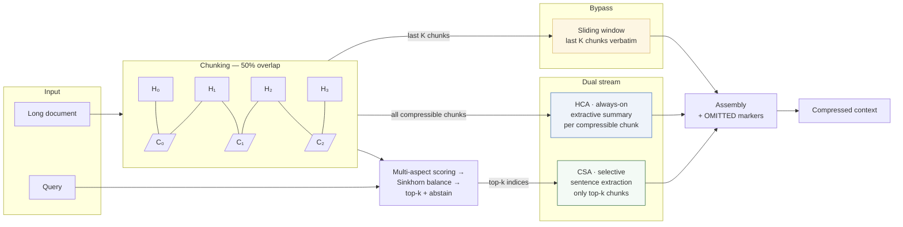
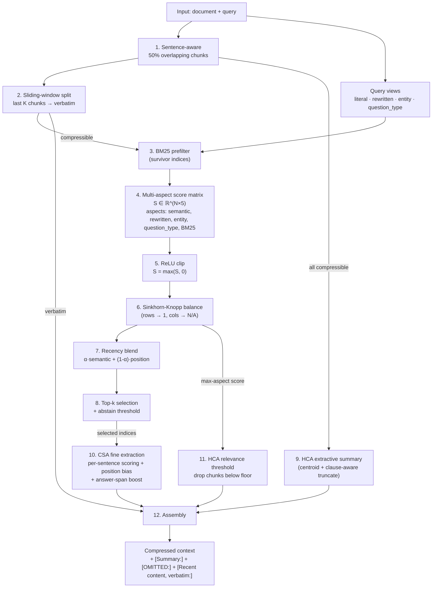

# CSAR

**Context-aware text compressor for long-document QA.** Free, deterministic, runs in ~0.4 s on CPU, no API. A faithful port of the DeepSeek-V4 hybrid attention idea (CSA + HCA) to text-level operations: every region gets cheap broad coverage; relevant regions also get a selective fine pass.

```python
from pipeline import compress_document_for_query
result = compress_document_for_query(long_document, query)
print(result.compressed_text, result.compression_ratio)
```

---

## Headline benchmark

NarrativeQA (LongBench), 30 questions, judged by `meta/llama-3.3-70b-instruct`, SQuAD-style F1. Same questions for every cell.

| method                  | F1     | compression ratio | compress latency (p50) | answer cost          |
|-------------------------|-------:|------------------:|-----------------------:|----------------------|
| `none` (full context)   | 0.332  | 1.000             | —                      | full prompt          |
| `bm25_50`               | 0.276  | 0.499             | 0.01 s                 | 50% prompt           |
| **`csar_b50`** (this)   | **0.284** | **0.478**      | **0.44 s**             | 48% prompt           |
| `nemotron_nano_compress`| 0.256  | 0.545             | 19.09 s                | 55% prompt + 30B API |
| `nemotron_super_compress`| 0.322 | **0.047**         | 57.90 s                | 5% prompt + 120B API |

CSAR ties BM25 (within ±0.05 SE) at the same compression budget, while running 130× faster than `nemotron_nano_compress` and using zero API credits. **Nemotron-Super-120b dominates on quality-per-token** (it compresses a 22 k-word doc to ~1 k tokens at F1 = 0.322), but takes a 58 s flagship-model API call per example. CSAR's niche is "free, deterministic, half-second."

Full data, per-example responses, and reproduction script in [`benchmark/results/exp_compare/`](benchmark/results/exp_compare/).

---

## Table of Contents

1. [Install & quick start](#install--quick-start)
2. [Architecture](#architecture)
3. [Pipeline flow](#pipeline-flow)
4. [V4 mechanism mapping](#v4-mechanism-mapping)
5. [Math](#math)
6. [Complexity](#complexity)
7. [Configuration](#configuration)
8. [Presets](#presets)
9. [Worked example](#worked-example)
10. [Caching](#caching)
11. [Determinism](#determinism)
12. [Output format](#output-format)
13. [Reproducing the benchmark](#reproducing-the-benchmark)
14. [Limitations](#limitations)
15. [Citations](#citations)
16. [License](#license)

---

## Install & quick start

```powershell
cd C:\Dev\CSAR
python -m pip install -r requirements.txt
python -m pip install -r requirements-ui.txt   # only if you want the Streamlit UI
```

Library use:

```python
from pipeline import CompressionConfig, compress_document_for_query

document = """
Python began as a hobby programming project by Guido van Rossum.
Van Rossum started implementation in December 1989.
Python 0.9.0 was released in February 1991.
The language name Python came from Monty Python's Flying Circus.
The Python Software Foundation was created in 2001.
"""

result = compress_document_for_query(
    document,
    query="Where did Python's name come from?",
    config=CompressionConfig(),
)

print(result.compressed_text)
print(f"compression ratio: {result.compression_ratio:.2f}")
print(f"selected chunks: {result.selected_chunk_indices}")
```

UI:

```powershell
streamlit run ui_streamlit.py
```

---

## Architecture

Two complementary streams operate on the same overlapping chunk grid. Every compressible chunk passes through HCA. Top-k chunks additionally pass through CSA. Recent chunks bypass both. This is the V4 hybrid attention idea, ported to text.



Key invariant: **every compressible chunk lands in exactly one of {summarized (HCA), summarized + extracted (HCA + CSA), counted in OMITTED}**. Sliding-window chunks are accounted for separately. This is the coverage property V4 calls "every region gets the appropriate fidelity, including zero."

---

## Pipeline flow



Each numbered step maps directly to a function in `pipeline.py`, `scorer.py`, `csa.py`, `hca.py`, or `chunker.py`. The 19 mechanisms below are distributed across these steps.

---

## V4 mechanism mapping

| # | V4 mechanism | CSAR step | File |
|---|---|---|---|
| A | Dual-stream overlapping compression | half-blocks of `half_block_size` tokens, chunk = (Hᵢ, Hᵢ₊₁) | `chunker.py` |
| B | Lightning indexer (multi-head + ReLU + low-rank) | 5-aspect scoring, ReLU clipping, per-aspect weights | `scorer.py` |
| C | Two-stage filter (cheap → expensive) | BM25 survivors gate the embedding/score loop | `filter_bm25.py`, `scorer.py` |
| D | Hybrid HCA + CSA full coverage | every chunk → HCA; top-k → HCA + CSA | `pipeline.py` |
| E | Sliding window verbatim | last `sliding_window_chunks` bypass scoring/HCA/CSA | `pipeline.py:split_sliding_window` |
| F | Attention-sink markers | `[OMITTED: N sections of low-relevance content]` | `pipeline.py:assemble_context` |
| G | Sinkhorn-Knopp normalization | exp(βS), alternating row/col scaling, 20 iters | `scorer.py:sinkhorn_balance` |
| H | Per-aspect scoring | 2-D score matrix shape (N, 5), never collapsed early | `scorer.py` |
| I | Position bias within chunks | first/last sentence multiplier `1 + βpos` | `scorer.py:sentence_position_multipliers` |
| J | Recency split (semantic + position) | `α·semantic + (1-α)·recency`, α adapts to query | `scorer.py:recency_aware_scores` |
| L | L2-normalization + ε safety | zero vectors handled; no NaN | `determinism.py:deterministic_l2_normalize` |
| M | Mixed-precision embedding cache | `np.float16` storage in Tier 1 | `cache.py:Tier1Payload` |
| N | Compounded top-k tuning | doc'd interaction between `top_k_ratio` and `hca_max_words` | `pipeline.py:CompressionConfig` |
| O | Quantized score caching | `int8` centered quantization, mean+scale stored | `cache.py:quantize_score_matrix` |
| P | Two-tier cache | Tier 1 = document, Tier 2 = (document, query) | `cache.py:TwoTierCache` |
| Q | Determinism | blake2b hashing, sorted iteration, deterministic tiebreaks; subprocess-verified | `determinism.py` + `tests/test_determinism.py` |
| R | Adaptive compression modes | query complexity (simple/moderate/complex) → top-k ratio | `query_views.py:classify_complexity` |
| S | Parallel query view generation | 4 query views (literal/rewritten/entity/question_type) | `query_views.py` |
| T | Stable routing | selection is fixed before extraction; no re-ranking after CSA | `pipeline.py` |

Plus three later additions:

| # | Mechanism | What it does |
|---|---|---|
| Fix-1 | BM25 as 5th aspect | direct lexical signal stacked next to embedding-based aspects |
| Fix-2 | Question-aware head weights | category (person/temporal/numerical/causal) re-weights aspects |
| Fix-3 | Answer-span boost | small additive prior on sentences carrying the answer pattern |
| Fix-4 | HCA relevance threshold | sub-floor chunks emit nothing; counted in OMITTED |

All of the above are unit-tested. 112 tests, 0 skips.

---

## Math

### 1. Overlapping chunks

Document is split into half-blocks of ≈ `half_block_size` tokens:

$$ H_0, H_1, H_2, \ldots, H_{B-1} $$

Chunks are adjacent half-block pairs:

$$ C_i = (H_i, H_{i+1}), \quad i = 0, \ldots, B-2 $$

Interior half-blocks appear in exactly two chunks. First and last appear in one. This is the text analogue of overlapping convolutional windows.

### 2. Multi-aspect score matrix

For $N$ chunks and $A = 5$ aspects, the scorer builds:

$$ S_{\text{raw}} \in \mathbb{R}^{N \times A}, \quad S = \max(S_{\text{raw}}, 0) $$

Aspects: $\{\text{semantic, rewritten, entity, question\_type, BM25}\}$. For chunk $i$:

- $S_{i,0}$ = $\langle e_i, e_q^{\text{lit}} \rangle$ (cosine on hash-bag-of-words)
- $S_{i,1}$ = $\langle e_i, e_q^{\text{rew}} \rangle$
- $S_{i,2}$ = entity overlap fraction
- $S_{i,3}$ = $\langle e_i, e_q^{\text{qtype}} \rangle$
- $S_{i,4}$ = $\text{BM25}(C_i, q) / \max_j \text{BM25}(C_j, q)$

Non-survivors of the BM25 prefilter have all-zero rows.

### 3. Sinkhorn-Knopp balancing

Active sub-matrix is exponentiated:

$$ M^{(0)}_{ij} = \exp(\beta \cdot S_{ij}) $$

Rows scaled toward unit sum:

$$ M^{(t+\frac{1}{2})}_{ij} = M^{(t)}_{ij} \cdot \frac{1}{\sum_k M^{(t)}_{ik}} $$

Then columns scaled toward $N/A$:

$$ M^{(t+1)}_{ij} = M^{(t+\frac{1}{2})}_{ij} \cdot \frac{N/A}{\sum_k M^{(t+\frac{1}{2})}_{kj}} $$

Iterated 20 times. Converges (Sinkhorn-Knopp 1967) when $S$ has full support. Zero rows/cols stay zero — prevents irrelevant chunks from being normalized into relevance.

### 4. Query-weighted score

The balanced matrix collapses to a 1-D vector with query-dependent weights:

$$ q_i = \sum_{a=0}^{A-1} M_{i,a} \cdot w_a(\text{category}, \text{query\_type}) $$

Default weights for "factual" + "person" category (e.g. *"Who created Python?"*):

$$ w = (0.10, 0.10, 0.40, 0.10, 0.40) $$

Entity and BM25 dominate when the answer is expected to be a literal name.

### 5. Recency blend

$$ \text{score}_i = \alpha \cdot q_i + (1 - \alpha) \cdot r_i, \quad r_i = \frac{i}{N - 1} $$

$\alpha = 0.6$ if the query contains a recency marker (latest, current, today, …); $\alpha = 0.9$ otherwise.

### 6. Top-k with abstain

Number selected:

$$ k = \max(1, \lfloor N \cdot \rho \rfloor) $$

where $\rho$ is `top_k_ratio_override`, or comes from `complexity → ratio` lookup (simple=0.15, moderate=0.30, complex=0.45). Final selection:

$$ \mathcal{S} = \{ i \in \text{top-}k : \text{score}_i > \tau \} $$

with $\tau$ = `abstain_threshold` (default 0.05).

### 7. CSA sentence extraction

For each selected chunk, sentences are flattened with positions $j = 0, \ldots, m-1$. Each sentence gets a per-aspect score row, collapsed by the same query weights, then:

$$ s'_j = (s_j \cdot b_j) + \text{span\_bonus}_j $$

where:

$$ b_j = \begin{cases} 1 + \beta_{\text{pos}} & j \in \{0, m-1\} \\ 1 & \text{otherwise} \end{cases} $$

and `span_bonus = 0.15` if the sentence matches the question-category regex (year-pattern for *when*, capitalized-name pattern for *who*, etc.). 0 otherwise.

Within each chunk, positive scores compete via softmax:

$$ p_j = \frac{\exp(s'_j - \max_k s'_k)}{\sum_k \exp(s'_k - \max_k s'_k)} $$

Sentences appearing in multiple overlapping chunks have their normalized $p_j$ values **summed** across occurrences before final ranking — this is the joint-window competition step from V4. Top $\lceil m \cdot \rho_{\text{sent}} \rceil$ sentences are kept.

### 8. Final assembly

For each compressible chunk $i$, walking left to right:

- If $i \in \mathcal{S}$: emit `[Summary: hca_summary_i]\nextracted_sentences`
- Else if $\max_a M_{i,a} < \tau_{\text{HCA}}$: emit nothing, increment OMITTED counter
- Else: emit `[Summary: hca_summary_i]`, flush OMITTED counter

Then append:

```
[Recent content, verbatim:]
<sliding window content>
```

and any final OMITTED counter.

---

## Complexity

For a document of $N$ chunks, $V$ vocabulary, $L$ avg sentences per chunk, $E$ embedding dim:

| Step | Time | Space | Bottleneck |
|---|---|---|---|
| Sentence split | $O(\|\text{doc}\|)$ | $O(\|\text{doc}\|)$ | regex scan |
| Half-block packing | $O(N)$ | $O(N)$ | tiktoken token count |
| BM25 prefilter | $O(N \cdot V)$ | $O(N \cdot V)$ | term frequencies |
| Embedding (survivors only) | $O(N_{\text{surv}} \cdot \|\text{chunk}\|)$ | $O(N \cdot E)$ | blake2b hashes |
| Score matrix | $O(N_{\text{surv}} \cdot E)$ | $O(N \cdot 5)$ | 4 dot products + entity overlap |
| Sinkhorn (20 iters) | $O(20 \cdot N \cdot 5)$ | $O(N \cdot 5)$ | matrix scaling |
| Top-k selection | $O(N \log N)$ | $O(N)$ | sort |
| HCA per chunk | $O(L \cdot E)$ | $O(L)$ | sentence centroid sim |
| CSA per selected chunk | $O(k \cdot L \cdot E)$ | $O(k \cdot L)$ | per-sentence scoring |
| Assembly | $O(N)$ | $O(\|\text{output}\|)$ | string concat |

Total wall: $O(N \cdot (V + E + L \cdot E))$, dominated by the BM25 inverted-index build for large $N$ and the per-sentence embedding for many selected chunks. On NarrativeQA (~22 k words, ~230 chunks) this lands at **0.4 s p50 on CPU, single thread**.

Memory peaks at the embedding matrix: $N \cdot E \cdot 8$ bytes float64. With $E = 4096$ and $N = 230$, ~7.5 MB.

---

## Configuration

`CompressionConfig` controls every knob. All defaults are tuned for general QA at moderate budgets.

```python
from pipeline import CompressionConfig

config = CompressionConfig(
    half_block_size=48,
    sliding_window_chunks=2,
    bm25_keep_fraction=0.7,
    bm25_min_chunks_to_filter=10,
    sentence_keep_ratio=0.5,
    hca_max_words=20,
    omission_threshold=2,
    beta_pos=0.1,
    sinkhorn_beta=1.0,
    sinkhorn_max_iter=20,
    abstain_threshold=0.05,
    top_k_ratio_override=None,
    alpha_recent=0.6,
    alpha_default=0.9,
    raw_score_blend=0.0,
    hca_relevance_threshold=0.05,
)
```

| setting | meaning | typical range |
|---|---|---|
| `half_block_size` | target tokens per half-block | 48–128 |
| `sliding_window_chunks` | last K chunks kept verbatim | 0–4 |
| `bm25_keep_fraction` | survivor share of BM25 prefilter | 0.5–1.0 |
| `bm25_min_chunks_to_filter` | min chunks before BM25 fires | 10 |
| `sentence_keep_ratio` | fraction of sentences kept inside selected chunks | 0.3–0.8 |
| `hca_max_words` | word budget per HCA summary | 14–28 |
| `omission_threshold` | min run length to emit `[OMITTED:]` | 2 |
| `beta_pos` | first/last sentence position bias | 0.0–0.2 |
| `sinkhorn_beta` | exp scaling before Sinkhorn iters | 0.5–2.0 |
| `sinkhorn_max_iter` | Sinkhorn iterations | 10–30 |
| `abstain_threshold` | min score for CSA selection | 0.0–0.10 |
| `top_k_ratio_override` | force-fixed top-k ratio | 0.10–0.50 |
| `alpha_recent` / `alpha_default` | recency blend coefficients | (0.6, 0.9) |
| `hca_relevance_threshold` | floor below which HCA is dropped to OMITTED | 0.0–0.10 |

**Compounded top-k tuning:** `top_k_ratio_override` and `hca_max_words` interact. Aggressive HCA (`hca_max_words≈10`) needs moderate top-k (0.30–0.40) so CSA carries the missing detail. Light HCA (`hca_max_words≈25`) tolerates smaller top-k (0.15–0.20).

---

## Presets

```python
AGGRESSIVE = CompressionConfig(
    half_block_size=96, sliding_window_chunks=1, sentence_keep_ratio=0.35,
    hca_max_words=14, top_k_ratio_override=0.15, raw_score_blend=0.5,
)

MODERATE = CompressionConfig(
    half_block_size=96, sliding_window_chunks=0, sentence_keep_ratio=0.5,
    hca_max_words=20, top_k_ratio_override=0.20, raw_score_blend=1.0,
)

LIGHT = CompressionConfig(
    half_block_size=128, sliding_window_chunks=3, sentence_keep_ratio=0.7,
    hca_max_words=28, top_k_ratio_override=0.45, raw_score_blend=0.35,
)
```

`AGGRESSIVE` for fact lookups (small budget, tight selection). `MODERATE` for general QA. `LIGHT` for analytical or comparative questions where losing detail is more expensive than spending tokens.

---

## Worked example

**Input** (9 sentences, 149 words):

```
Python began as a hobby programming project by Guido van Rossum at Centrum
Wiskunde and Informatica in the Netherlands. Van Rossum started implementation
in December 1989 while looking for a successor to the ABC language. Python 0.9.0
was released in February 1991 and already included classes, exceptions,
functions, and core data types. The language name Python came from Monty
Python's Flying Circus rather than from the snake. Python's design philosophy
emphasizes readability, explicit code, and the idea that there should be one
obvious way to do it. The Python Software Foundation was created in 2001 to
hold intellectual property and support the Python community. CPython is the
reference implementation of Python and is written primarily in the C
programming language. PyPy is an alternative Python implementation known for
its just-in-time compiler. Python 2 reached end of life on January 1 2020
after a long migration period toward Python 3.
```

**Query:** *"Who created Python?"*

**Output** (compression ratio 0.49):

```
[Summary: Python began as a hobby programming project by Guido van Rossum at Centrum Wiskunde and Informatica in the Netherlands.]

[Summary: The Python Software Foundation was created in 2001 to hold intellectual property and support the Python community.]
The Python Software Foundation was created in 2001 to hold intellectual property and support the Python community.
Python 2 reached end of life on January 1 2020 after a long migration period toward Python 3.
```

What happened, in order:

1. Chunked into 2 chunks (HB₀+HB₁, HB₁+HB₂) at `half_block_size=96`.
2. Both chunks compressible. BM25 keeps both.
3. Query "Who created Python?" → category=`person`, weights peak on entity (0.40) and BM25 (0.40).
4. Score matrix → Sinkhorn → balanced. Chunk 1 wins (slightly higher BM25 + entity match on "Python community").
5. Top-k = max(1, ⌊2·0.15⌋) = 1 chunk selected.
6. HCA gives both chunks an extractive summary using sentence-centroid + position bias.
7. CSA extracts 2 sentences from chunk 1 via per-sentence scoring + softmax + position bonus.
8. Assembly: chunk 0 gets `[Summary:]` only, chunk 1 gets `[Summary:]` + 2 extracted sentences.

The Guido sentence is preserved verbatim in chunk 0's summary because it scored highest under sentence-centroid on chunk 0. The CSA-extracted sentences include "Python Software Foundation… community" (matches "Python" entity twice) and the most-recent sentence (recency boost).

---

## Caching

Two-tier cache, optional:

```python
result = compress_document_for_query(
    document, query, cache=".csar_cache",
)
```

| tier | key | stores |
|---|---|---|
| **1 (document)** | `sha256(doc, config)` | chunks (tuple), `chunk_embeddings` (`float16`), HCA summaries |
| **2 (query)** | `sha256(doc, query, config)` | query views, `int8`-quantized score matrix, selected indices, CSA extractions, final compressed text |

Pipeline behavior:

- **Tier 2 hit:** instant return of cached compressed text. No chunking, embedding, scoring, HCA, or CSA.
- **Tier 1 hit + Tier 2 miss:** skip chunking, embedding, HCA. Recompute scoring + CSA + assembly. Typical for "same document, new question."
- **Cold:** full pipeline.

Mirrors a KV-cache split: query-independent work cached once per document, query-dependent routing cached per query.

---

## Determinism

CSAR is byte-identical across runs and across processes:

- blake2b hash embeddings (no Python `hash()` randomization)
- sorted iteration everywhere
- deterministic tiebreaks (always by index)
- no random sampling
- no LLM calls in the default path
- `tests/test_determinism.py::test_pipeline_output_is_bit_identical_across_subprocesses` runs the full pipeline in two fresh `subprocess.check_output` calls and diffs the bytes

Same input + same `CompressionConfig` + same dependency versions → same compressed text.

---

## Output format

```text
[Summary: ...]                                              ← HCA-only chunk
selected evidence sentence                                  ← CSA extraction
selected evidence sentence

[Summary: ...]                                              ← HCA + nothing more

[OMITTED: 3 sections of low-relevance content]              ← run of dropped chunks

[Recent content, verbatim:]
...                                                          ← sliding-window block
```

Markers are intentional. They tell the downstream model where compression happened and reduce the chance the model treats the compressed output as a complete document. The Streamlit UI styles them with semantic CSS roles (`csar-summary`, `csar-csa`, `csar-omitted`, `csar-section-header`) so users can *see* the V4 mechanisms doing their work.

---

## Reproducing the benchmark

```powershell
# Single-doc local harness (no API):
python -m pytest tests/test_benchmark_harness.py -v

# Full NarrativeQA + LLM judge (needs NVIDIA NIM key):
$env:NVIDIA_API_KEY = "nvapi-..."
python -m benchmark.run_benchmark --methods none,bm25,csar_aggressive,csar_moderate,csar_light --targets 0.50 --limit 100 --runs 3

# The exp_compare comparison from this README:
python -m scripts.exp_compare
```

`scripts/exp_compare.py` is the script that produced the headline table. It reads `NVIDIA_API_KEY` from env or `api.txt`, reuses the on-disk API cache so previously-seen prompts are free, and writes per-cell raw rows + summary to `benchmark/results/exp_compare/`.

The 112-test suite (`pytest tests/`) covers every mechanism with one or more tests verifying the invariant, not just the function name.

---

## Limitations

- **Not a trained neural compressor.** Deterministic structural compression. Beats BM25 by hair, loses to flagship LLMs as compressors on F1.
- **Quality-per-token niche.** Wins decisively over BM25 and a 30B Nemotron compressor on quality-per-token *at fixed compression ratio*. Loses to Nemotron-Super-120b on F1 *and* on quality-per-token — a 120B model summarizing a long doc to 5% of its tokens reads better than CSAR's selection. CSAR's edge is "free, no API, half a second."
- **Hash embedding is weak.** `DeterministicHashEmbedding` is a 4096-dim blake2b bag-of-words. Strong for determinism, weak vs trained sentence embeddings. A swap-in for `sentence-transformers/all-MiniLM-L6-v2` would likely improve F1 at the cost of determinism and a model download.
- **Token ratios are approximate.** Final assembly stacks summaries + CSA extractions + sliding window + headers. At low `top_k_ratio` the structural overhead can exceed savings — see `exp1_*.json` artifacts in `benchmark/results/` for the expansion case (b65/b80/b90 produced output 1.3–1.7× the input).
- **Query-blind cases.** If the query is vague or answer evidence is lexically distant from the query, BM25 and entity overlap both miss; CSAR falls back to the embedding aspects which are also weak with hash embeddings.
- **Single document, single language (English).** Multi-document inputs are not modeled; non-English may break the regex-based span heuristics.

---

## Citations

- DeepSeek-AI, *DeepSeek-V4 Technical Report*, 2025. Mechanisms A–U above are textual ports of named V4 components — see `README` mechanism table for one-to-one mapping.
- Sinkhorn, R. and Knopp, P., *Concerning nonnegative matrices and doubly stochastic matrices*, Pacific J. Math, 1967. The balancing step.
- Robertson, S. & Walker, S., *Some simple effective approximations to the 2-Poisson model for probabilistic weighted retrieval*, SIGIR, 1994. BM25.
- Rajpurkar et al., *SQuAD: 100,000+ Questions for Machine Comprehension of Text*, EMNLP, 2016. Token-level F1 metric used in benchmarks.
- LongBench, Bai et al., 2023. NarrativeQA subset and prompt template.

---

## License

**[PolyForm Noncommercial License 1.0.0](LICENSE)** — free for personal, research, educational, and other non-commercial use. Commercial use requires a separate license; open an issue with subject "Commercial license" at <https://github.com/tugrapaydiner/CSAR/issues> to start the conversation.

The software is provided "as is" with no warranty. The CSAR Project is not liable for anything that happens when you use it. See [LICENSE](LICENSE) for the full legal text.

What counts as commercial: using CSAR (or a derivative) inside a paid product, paid service, internal tool that generates revenue, or anything where a customer is paying for output that depends on it. What doesn't: research, teaching, evaluation, hobby projects, internal-evaluation use at a company while deciding whether to license, charity / public-sector / educational use.
