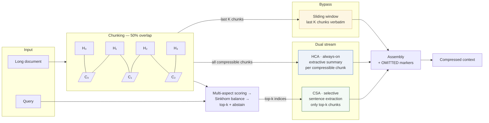
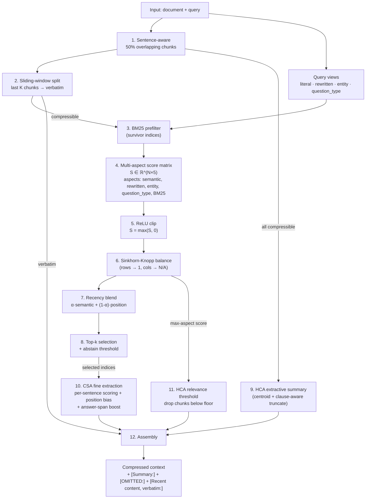

<div align="center">

# CSAR

### Compressed Sparse Attention Router

*Context-aware text compressor for long-document QA.*
*Free · deterministic · ~0.4 s on CPU · no API.*


</div>

<br>

A faithful port of the **DeepSeek-V4** hybrid attention idea (CSA + HCA) to text-level operations: every region gets cheap broad coverage; relevant regions also get a selective fine pass.

```python
from pipeline import compress_document_for_query

result = compress_document_for_query(long_document, query)
print(result.compressed_text, result.compression_ratio)
```

<br>

---

## 🏆 Headline benchmark

NarrativeQA (LongBench), 30 questions, judged by `meta/llama-3.3-70b-instruct`, SQuAD-style F1. Same questions for every cell.

<br>

| method                         |        F1 (mean ± std) | actual ratio |  compress p50 | answer cost           |
|--------------------------------|-----------------------:|-------------:|--------------:|-----------------------|
| `none` (full context)          |          0.332 ± 0.245 |        1.000 |             — | full prompt           |
| `bm25_50`                      |          0.276 ± 0.261 |        0.499 |       0.015 s | 50 % prompt           |
| 🌟 **`csar_b50`** (this work)  |      **0.284 ± 0.291** |    **0.478** |   **0.440 s** | 48 % prompt           |
| `nemotron_nano_compress`       |          0.256 ± 0.267 |       0.545¹ |      19.091 s | 55 % prompt + 30B API |
| `nemotron_super_compress`      |          0.322 ± 0.274 |    **0.047** |      57.901 s | 5 % prompt + 120B API |

<sub>¹ Median ratio is 1.000: Nemotron-Nano fell back to the original document on 16 / 30 examples.</sub>

<br>

### 🔍 Honest read at *n* = 30

Std bands are wider than every gap between methods. F1 differences in the 0.02–0.06 range cannot be distinguished from noise at this sample size. Defensible claims:

- 🤝 **CSAR ties BM25 on quality** — paired per-example: 5 wins, 3 losses, 22 ties; mean Δ F1 = +0.007, paired *t* = 0.28. CSAR adapts its compression ratio per document (0.36 – 0.57) where BM25 is locked to a hard 0.50 budget.
- ⚡ **CSAR runs ~130× faster than the cheapest neural compressor** — 0.44 s vs 19 s for Nemotron-Nano, with no API call and no GPU.
- 🎯 **A 120B LLM-as-compressor (Nemotron-Super) is the only method on the frontier** — F1 = 0.322 at ratio = 0.047. CSAR's pitch versus that model is cost, latency, determinism, and on-prem deployment — not F1.

<br>

---

## 🏗️ Architecture

Two complementary streams operate on the same overlapping chunk grid. Every compressible chunk passes through HCA. Top-k chunks additionally pass through CSA. Recent chunks bypass both.

<br>



<br>

> 🔑 **Key invariant.** Every compressible chunk lands in exactly one of {summarized (HCA), summarized + extracted (HCA + CSA), counted in OMITTED}. Sliding-window chunks are accounted for separately. This is the coverage property V4 calls *"every region gets the appropriate fidelity, including zero."*

<br>

---

## 🔄 Pipeline flow



<br>

📂 Each numbered step maps directly to a function in `pipeline.py`, `scorer.py`, `csa.py`, `hca.py`, or `chunker.py`.

<br>

---

## 📊 Per-method F1

Mean F1 with a translucent ±1 σ band behind each bar to show how much room the noise occupies.

<br>


<br>

> 💬 **What this says.** No-compression and Nemotron-Super (a 120B LLM compressor) lead. CSAR sits at 0.284, a hair above BM25 at 0.276. The bands cover roughly ±0.27 on every method — wider than any difference between methods. Means alone are not trustworthy at *n* = 30.

<br>

---

## 📈 Compression / quality frontier

Each method occupies a point in the (ratio, F1) plane. ⬆️⬅️ Top-left is the goal: maximum quality, minimum tokens.

<br>


<br>

> 💬 **What this says.** Nemotron-Super-120B is alone in the upper-left at ~5 % ratio with near-baseline F1 — the only method on the actual frontier. CSAR and BM25 occupy the same point in the middle: 50 % budget, indistinguishable F1.

<br>

---

## 🥊 Per-example head-to-head

The bar chart shows means; this matrix shows what actually happened on the 30 individual questions. Each cell is wins–losses (with ties in parentheses) for the row method against the column method.

<br>


<br>

> 💬 **What this says.** No method is robustly better than another at this sample size — most cells show 14–22 ties out of 30. CSAR vs BM25 is 5–3 with 22 ties (paired *t* = 0.28); CSAR vs Nemotron-Super is 6–10 with 14 ties; CSAR vs no-compression is 5–11 with 14 ties.

<br>

---

## ⚡ Compression latency

The other axis CSAR competes on is wall-clock time. Three orders of magnitude separate the methods.

<br>


<br>

> 💬 **What this says.** BM25 is the floor at 15 ms — a pure index lookup. CSAR adds 425 ms of structural compression on top of that. Both stay subsecond and run on CPU with no API call. The neural compressors are 19 s and 58 s respectively, dominated by the round-trip to NVIDIA NIM and the 30B / 120B model forward passes. Not at the top of the F1 chart, but on the latency / cost axis the F1 chart cannot see.

<br>

---

## 📉 Compression aggressiveness

The summary table reports a single mean ratio per method, hiding two interesting properties: BM25 is a hard budget, CSAR adapts per-document, and Nemotron-Nano often refuses to compress at all.

<br>


<br>

> 💬 **What this says.** CSAR ratios range 36–57 % around the 50 % target — the model spends more or fewer tokens per document depending on what the scoring matrix says is worth keeping. BM25 is locked to a hard 50 %. Nemotron-Nano fell back to the original document on 16 / 30 examples, so its median ratio is 100 %.

<br>

---

## 📐 Math

### 1. Overlapping chunks

Document is split into half-blocks of approximately `half_block_size` tokens:

$$ H_0, H_1, H_2, \ldots, H_{B-1} $$

Chunks are adjacent half-block pairs:

$$ C_i = (H_i, H_{i+1}), \quad i = 0, \ldots, B-2 $$

Interior half-blocks appear in exactly two chunks; first and last appear in one. This is the text analogue of overlapping convolutional windows.

<br>

### 2. Multi-aspect score matrix

For $N$ chunks and $A = 5$ aspects, the scorer builds:

$$ S_{\mathrm{raw}} \in \mathbb{R}^{N \times A}, \quad S = \max(S_{\mathrm{raw}}, 0) $$

Aspects:

$$ \{\mathrm{semantic}, \mathrm{rewritten}, \mathrm{entity}, \mathrm{questionType}, \mathrm{BM25}\} $$

For chunk $i$:

- $S_{i,0} = \langle e_i, e_q^{\mathrm{lit}} \rangle$  
  cosine on hash-bag-of-words

- $S_{i,1} = \langle e_i, e_q^{\mathrm{rew}} \rangle$

- $S_{i,2} =$ entity overlap fraction

- $S_{i,3} = \langle e_i, e_q^{\mathrm{qtype}} \rangle$

- $S_{i,4} = \mathrm{BM25}(C_i, q) / \max_j \mathrm{BM25}(C_j, q)$

Non-survivors of the BM25 prefilter have all-zero rows.

<br>

### 3. Sinkhorn-Knopp balancing

Active sub-matrix is exponentiated:

$$ M^{(0)}_{ij} = \exp(\beta \cdot S_{ij}) $$

Rows are scaled toward unit sum:

$$ M^{(t+\frac{1}{2})}_{ij} = M^{(t)}_{ij} \cdot \frac{1}{\sum_k M^{(t)}_{ik}} $$

Then columns are scaled toward $N/A$:

$$ M^{(t+1)}_{ij} = M^{(t+\frac{1}{2})}_{ij} \cdot \frac{N/A}{\sum_k M^{(t+\frac{1}{2})}_{kj}} $$

This is iterated 20 times. It converges when $S$ has full support. Zero rows or columns stay zero, which prevents irrelevant chunks from being normalized into relevance.

<br>

### 4. Query-weighted score

The balanced matrix collapses to a 1-D vector with query-dependent weights:

$$ q_i = \sum_{a=0}^{A-1} M_{i,a} \cdot w_a(\mathrm{category}, \mathrm{queryType}) $$

Default weights for `"factual"` + `"person"` category, such as *"Who created Python?"*:

$$ w = (0.10, 0.10, 0.40, 0.10, 0.40) $$

Entity and BM25 dominate when the answer is expected to be a literal name.

<br>

### 5. Recency blend

$$ \mathrm{score}_i = \alpha \cdot q_i + (1 - \alpha) \cdot r_i, \quad r_i = \frac{i}{N - 1} $$

$\alpha = 0.6$ if the query contains a recency marker such as latest, current, today, etc.  
Otherwise, $\alpha = 0.9$.

<br>

### 6. Top-k with abstain

Number selected:

$$ k = \max(1, \lfloor N \cdot \rho \rfloor) $$

where $\rho$ is `top_k_ratio_override`, or comes from the `complexity → ratio` lookup:

- simple = `0.15`
- moderate = `0.30`
- complex = `0.45`

Final selection:

$$ \mathcal{S} = \{ i \in \mathrm{topK} : \mathrm{score}_i > \tau \} $$

with $\tau =$ `abstain_threshold`, default `0.05`.

<br>

### 7. CSA sentence extraction

For each selected chunk, sentences are flattened with positions:

$$ j = 0, \ldots, m - 1 $$

Each sentence gets a per-aspect score row, collapsed by the same query weights:

$$ s'_j = (s_j \cdot b_j) + \mathrm{spanBonus}_j $$

where:

$$ b_j = \begin{cases} 1 + \beta_{\mathrm{pos}}, & j \in \{0, m - 1\} \\ 1, & \mathrm{otherwise} \end{cases} $$

`span_bonus = 0.15` if the sentence matches the question-category regex, such as:

- year pattern for *when*
- capitalized-name pattern for *who*

Otherwise, `span_bonus = 0`.

Within each chunk, positive scores compete via softmax:

$$ p_j = \frac{\exp(s'_j - \max_k s'_k)}{\sum_k \exp(s'_k - \max_k s'_k)} $$

Sentences appearing in multiple overlapping chunks have their normalized $p_j$ summed across occurrences before final ranking. This is the joint-window competition step from V4.

Top $\lceil m \cdot \rho_{\mathrm{sent}} \rceil$ sentences are kept.

<br>

### 8. Final assembly

For each compressible chunk $i$, walking left to right:

- If $i \in \mathcal{S}$:  
  emit `[Summary: hca_summary_i]\nextracted_sentences`

- Else if $\max_a M_{i,a} < \tau_{\mathrm{HCA}}$:  
  emit nothing and increment the OMITTED counter

- Else:  
  emit `[Summary: hca_summary_i]` and flush the OMITTED counter

Then append the sliding-window block and any final OMITTED counter.

<br>

---

## 📦 Install & reproduce

```powershell
cd C:\Dev\CSAR
python -m pip install -r requirements.txt
python -m pip install -r requirements-ui.txt   # Streamlit UI (optional)
```

<br>

```python


from pipeline import CompressionConfig, compress_document_for_query

result = compress_document_for_query(
    document,
    query="Where did Python's name come from?",
    config=CompressionConfig(),
)

print(result.compressed_text)
print(f"compression ratio: {result.compression_ratio:.2f}")
```

<br>

Reproducing the headline benchmark:

```powershell
# Single-doc local harness (no API):
python -m pytest tests/test_benchmark_harness.py -v

# Full NarrativeQA + LLM judge (needs NVIDIA NIM key):
$env:NVIDIA_API_KEY = "nvapi-..."
python -m benchmark.run_benchmark --methods none,bm25,csar_aggressive,csar_moderate,csar_light --targets 0.50 --limit 100 --runs 3

# The exp_compare comparison from this README:
python -m scripts.exp_compare
```

<br>

---

## 📄 License

**[PolyForm Noncommercial License 1.0.0](LICENSE)** — free for personal, research, educational, and other non-commercial use. Commercial use requires a separate license; open an issue with subject *"Commercial license"* at <https://github.com/tugrapaydiner/CSAR/issues> to start the conversation.

The software is provided "as is" with no warranty. The CSAR Project is not liable for anything that happens when you use it. See [LICENSE](LICENSE) for the full legal text.

**What counts as commercial:** using CSAR (or a derivative) inside a paid product, paid service, internal tool that generates revenue, or anything where a customer is paying for output that depends on it.

**What doesn't:** research, teaching, evaluation, hobby projects, internal-evaluation use at a company while deciding whether to license, charity / public-sector / educational use.
